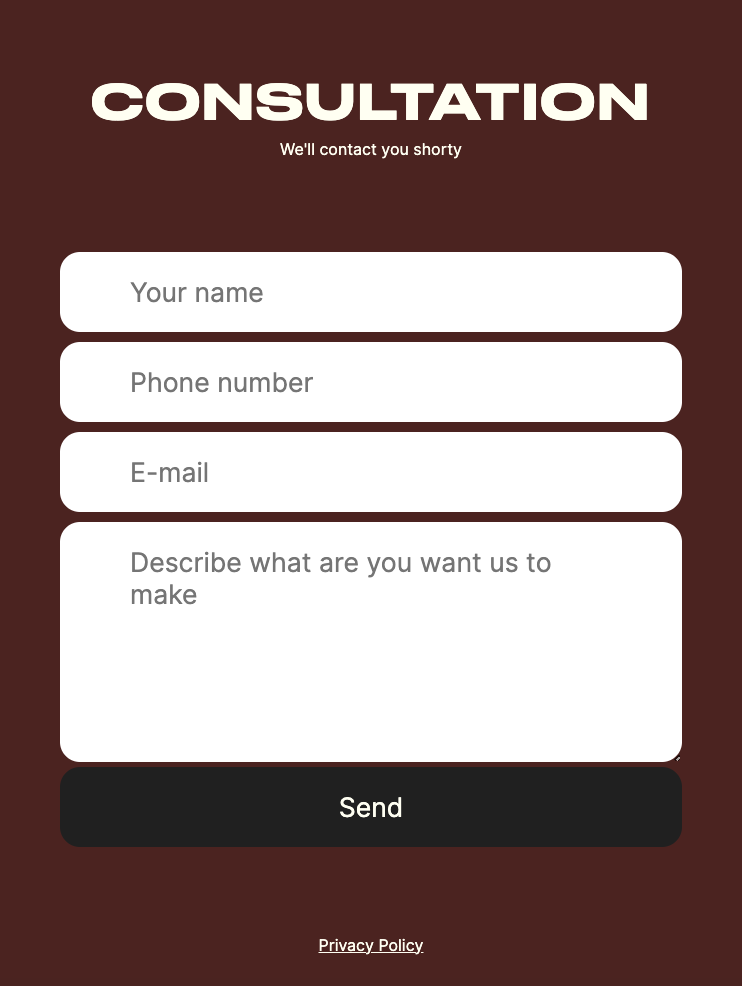
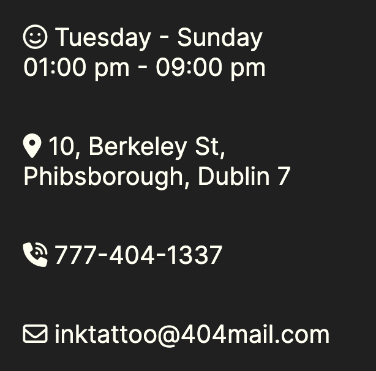

# INK TATTOO

INK TATTOO is a website designed to assist you in selecting and creating a unique tattoo design tailored to each client's preferences.
On our website, you can fill out a form to initiate a consultation with our manager.
You'll gain insights into our studio and have the opportunity to peruse a gallery showcasing our work process.
Furthermore, you can find answers to the most commonly asked questions in the FAQ section.

You can have a view by following this ---> [Link](https://genaplem.github.io/ink_tattoo/) <---


- - -

## Table of content

- [Description](#ink-tattoo)
- [Table of content](#table-of-content)
- [UX](#user-experience)
  - [Site Navigation](#site-navigation)
  - [Registration for a Consultation](#registration-for-a-consultation)
  - [About us](#about-us)
  - [Gallery](#gallery)
  - [Our Social Networks](#our-social-networks)
  - [Contact us](#contact-us)
  - [Privacy policy](#privacy-policy)
- [Future features](#future-features)
- [Design](#design)
  - [Colors](#colors)
  - [Fonts](#fonts)
  - [Images](#images)
  - [Wireframes](#wireframes)
- [Technologies](#technologies)
- [Frameworks, Libraries & Programs](#frameworks-libraries--programs)
- [Testing](#testing)
  - [HTML validation](#html-validation)
  - [CSS validation](#css-validation)
  - [Lighthouse](#lighthouse)
  - [Manual testing](#manual-testing)
  - [Known bugs](#known-bugs)
  - [Encountered Issues](#encountered-issues-during-development)
- [Deployment and local development](#deployment-and-local-development)
  - [Local Development](#local-development)
  - [Deployment](#deployment-to-github-pages)
- [Credits](#credits)
  - [Acknowledgements](#acknowledgements)
  - [Media and Content](#media-and-content)

- - -

## User Experience

### Site navigation

- The website features a prominent navigation menu positioned at the top, providing quick and convenient access to all sections of the page. The menu has been designed with both new and experienced users in mind
  - **Desktop Version:** On desktop screens, users are presented with navigation links that are clearly visible and easy to click.<br>
  
  - **Mobile/Tablet Version:** To cater to mobile and tablet users, the navigation menu is transformed into a burger menu, offering a space-efficient and intuitive navigation solution.<br>
  

### Registration for a Consultation

- To streamline the process for new users seeking personalized assistance, the website provides a user-friendly form that enables quick and convenient appointment scheduling for consultations with the manager. This feature is accessible through the "Booking to consultation" button prominently placed in the first section of the website.<br>
  
  - **Booking to Consultation Form:** The form has been designed to be intuitive and straightforward, allowing users to input their details and preferences efficiently.<br>
  

### About us

- The about us section provides a brief description of our company that users can read to better understand what we offer.<br>
    

### Gallery 

- Users can explore the artistic journey of INK TATTOO through our gallery, showcasing a diverse collection of masterpieces created by our talented artists.<br>
    

### Frequently Asked Questions

- To provide users with quick and informative assistance, the project features a comprehensive FAQ section that addresses common queries.<br>


### Our Social Networks

- In the "Contact" section of the website, new users have the opportunity to connect and explore INK TATTOO's presence on various social media platforms. The process is seamless: by clicking on the provided links, users can easily navigate to their desired social network platforms.<br>
    

### Contact Us

- The project places a strong emphasis on accessibility and communication for both new and returning users. The "Contacts" section is designed to facilitate easy interaction for any inquiries, questions, or booking requests.
  - **Our contacts:** In the "Contacts" section, users can find dedicated phone numbers and an email address, enabling direct communication for any queries or booking-related matters.<br>
  
  - **Location Map:** The "Contacts" section also includes a map that allows users to effortlessly locate our physical address. This feature provides users with a visual representation of our location, aiding in navigation and enhancing the overall user experience.<br>
  

### Privacy policy

- Users can read our privacy policy by clicking on the appropriate button<br>
  
- By clicking on this button users are taken to a page with our privacy policy. Privacy policy on this page was generated by [PrivacyPolicyGenerator](https://www.privacypolicygenerator.info/download.php?lang=en&token=SzCNy93nSjmDJDRGR07sRHuvqFqfGWmU#) special for this website<br>
  

- - -

## Future features

Since I would like to continue to develop the INK TATTOO project, I have several exciting features in mind that will enhance the user experience and functionality:
* **Comprehensive Form Validation:** In the future, I plan to implement full form validation using JavaScript. This will ensure that all user inputs are accurately validated before submission, enhancing data integrity and user experience.
* **Server-Side Data Handling:** My roadmap includes refining the form functionality to establish a connection between the user's input and the server. This will allow for real data submissions and interactions, ensuring that user inquiries and consultation requests are securely transmitted.
* **Enhanced Menu Interaction:** I will work on making menu navigation even more user-friendly by incorporating JavaScript to provide smoother interactions. This will enhance the overall navigation experience, especially on mobile devices, making it easier for users to explore our website.

- - -

## Design

### Colors

- The color palette was carefully selected using the free palette creation service [Coolors.co](https://coolors.co/). The secondary color opacity was reduced to 30% for a dark red effect.<br>


### Fonts

Two fonts are used on this website:
- **Druk Wide Cy Web** is used for the logo and headings in each section. It was downloaded from the free font repository [8font.com](https://8font.com/).
- **Inter** is used for the main body text. It was sourced from [Google fonts](https://fonts.google.com/).

### Images

- All images on this website were sourced from the free service [Freepik](https://www.freepik.com/).
They were then converted from PNG to WebP format using the free tool [Aconvert](https://www.aconvert.com/), and their sizes were optimized using [Tinypng](https://tinypng.com/)

### Wireframes

- I developed the website design using Figma, a collaborative design tool. The wireframes were created to visually plan the layout and user interface of the website before development began.<br>


- - -

## Technologies

* [HTML](https://en.wikipedia.org/wiki/HTML5)
* [CSS](https://en.wikipedia.org/wiki/CSS)

- - -

## Frameworks, Libraries & Programs

* [Git](https://git-scm.com/download/mac)
  * for version control.
* [Github](https://github.com/)
  * for storing the project and deployment.
* [WebStorm](https://www.jetbrains.com/webstorm/)
  * IDE for coding.
* [Figma](https://www.figma.com/)
  * for wireframes and design.
* [Coolors](https://coolors.co/)
  * for colors palette creation. 
* [8font](https://8font.com/) and [Google fonts](https://fonts.google.com/)
  * for downloading fonts.
* [Freepik](https://www.freepik.com/)
  * for downloading images.
* [Aconvert](https://www.aconvert.com/)
  * for converting images to webp format.
* [TinyPNG](https://tinypng.com/)
  * for optimizing size of images.
* [Icon-icons](https://icon-icons.com/)
  * for icon for the browser tab.
* [PrivacyPolicyGenerator](https://www.privacypolicygenerator.info/)
  * for generation Privacy policy.
* [Fontawesome](https://fontawesome.com/)
  * for icons.
* [Am i Responsive](https://ui.dev/amiresponsive)
  * for mockup in readme.
  
- - -

## Testing

### HTML validation

- No errors found on main page with W3C validator<br>
  
- No errors found on privacy policy page with W3C validator<br>
  

### CSS validation

- No errors found with W3C.<br>
  

### Lighthouse

- Achieved a perfect score of 100 in accessibility, performance, best practices, and SEO categories in both mobile and desktop versions.
  - Mobile Version:<br>
    
  - Desktop Version:<br>
    


### Manual testing

- The site has been thoroughly tested to ensure its compatibility and functionality across various scenarios:
  - The site has been tested on different operating systems, including Windows and macOS.
  - Testing has been conducted on different devices, including desktop computers, laptops, and mobile devices.
  - Compatibility has been verified across multiple browsers, such as Google Chrome, Safari, and Firefox.


- During manual testing, the following aspects were evaluated:
  - **Responsive Design:** The website's responsiveness was confirmed across various screen sizes and devices to ensure optimal user experience.
  - **Functionality:** All interactive elements, such as buttons, forms, and links, were tested to ensure they perform their intended actions.
  - **Cross-Browser Compatibility:** The website was tested on different browsers to identify and address any compatibility issues.
  - **Page Loading:** The loading times of different pages were measured to ensure quick and efficient loading.
  - **Navigation:** Navigational elements and menu options were tested to verify seamless navigation throughout the website.
  - **Form Submissions:** Form interactions were tested to ensure proper validation. As the form submissions are directed to a template provided by Code Institute, the testing focused on form interactions rather than actual submissions.


- As a result of comprehensive manual testing, the website has been validated for its consistent performance and user-friendly experience across diverse environments.

### Known Bugs

1. While extensive efforts have been made to ensure a smooth user experience, there is a known issue with the form's phone number validation due to the limitations of this project being solely developed using HTML and CSS. Since JavaScript is not employed in this project, advanced form validations, such as phone number formatting, cannot be achieved.

   - **Issue:** Phone number validation is not enforced due to the absence of JavaScript.
   - **Impact:** Users may input phone numbers in various formats that do not conform to the expected pattern.


2. Despite careful development, a known issue affects the menu's behavior. Currently, the menu doesn't close when users click outside the menu area. It can only be closed using the close icon, which can lead to suboptimal user experience.
    - **Issue:** The menu does not close when clicking outside the menu area.
    - **Impact:** Users might find it inconvenient to only close the menu using the dedicated close icon, which could negatively affect user experience.

### Encountered Issues During Development

While developing the project, several issues were encountered and resolved.
1. One notable challenge was related to the initial navigation menu, which relied on hover interactions within an unordered list. However, this approach proved ineffective on the mobile version when were deployed on github pages and tested on mobile phone.
   - **Issue:** The initial menu design using hover interactions on an unordered list`ul`didn't work as expected on mobile devices.
   - **Resolution:** The issue was addressed by implementing a`input[type=checkbox]`to control the menu. This ensured consistent behavior across both desktop and mobile devices, enhancing user accessibility and experience.


2. Second issue arose when implementing dynamic width `100dvw` for a map container. In specific browser scenarios where the scroll bar consumes a portion of the screen width, the scroll bar width was not properly accounted for. This resulted in a horizontal scroll appearing in the screen width range from ```768px``` to ```1024px```.
   - **Issue:** The dynamic width (dvw) applied to the map container didn't account for the width of the scroll bar in browsers where it occupied screen space, leading to an unintended horizontal scroll between `768px` and `1024px`.<br>
   
   - **Resolution:** To mitigate this issue, the decision was made to restrict horizontal scrolling by applying `overflow-x: hidden;` to the entire content. While this resolved the horizontal scrolling problem, a small portion of the map might be hidden beneath the scroll bar. This trade-off was made in favor of a better user experience.<br>
   


3. Third issue that emerged during testing with the W3C CSS Validator was related to an animation effect applied on hover to the links within the menu on the desktop version. The validator reported an error stating `Property scale doesn't exist.`
   - **Issue:** The hover animation effect applied to menu links on the desktop version raised an error in the W3C CSS Validator, reporting that the property "scale" doesn't exist.<br>
   
   - **Resolution:** To address this issue, the approach was adjusted by using the transform property with the scale function. The animation effect was achieved by applying `transform: scale();` instead of `scale()`.

- - -

## Deployment and local development

### Local Development

To start working on the INK TATTOO project locally, follow these steps:
1. **Clone the Repository:** Clone the GitHub repository to your local machine using the following command in your terminal: <br>
`git clone https://github.com/GenaPlem/ink_tattoo.git`
2. Navigate to the Project Directory: Change to the project directory:<br>
`cd ink_tattoo`
3. **Open in a Code Editor:** Use your preferred code editor to open the project files.
4. **Make Changes:** Edit and customize the files according to your requirements.
5. **Test Locally:** Open the HTML files in a web browser to preview the changes locally.

### Deployment to GitHub Pages

Once you've made the desired changes and tested them locally, you can deploy the project to GitHub Pages. Here's how:
1. **Create a GitHub Repository:** If you haven't already, create a repository for your project on GitHub.
2. **Push Changes:** Commit and push your changes to the GitHub repository:<br>
`git add .`<br>
`git commit -m "Your commit message"`<br>
`git push origin main`
3. **Access Repository Settings:** Go to the GitHub repository's settings.
4. **GitHub Pages Section:** Scroll down to the "GitHub Pages" section.
5. **Source Selection:** From the dropdown menu under "Source," choose "main" or "master" as the branch you want to deploy.
6. **Save:** Click the "Save" button.
7. **Deployment:** After a few moments, your site will be deployed to a URL like https://GenaPlem.github.io/ink_tattoo/.

- - -

## Credits

### Acknowledgements

Special thanks to my mentor [Mitko Bachvarov](https://github.com/MitkoBachvarov) for his support and thorough reviews throughout the development process.

### Media and Content

* [Freepik](https://www.freepik.com/) free stock images.
* [Aconvert](https://www.aconvert.com/) free converting all type of files.
* [TinyPNG](https://tinypng.com/) resizing images.
* [Icon-icons](https://icon-icons.com/) icon for browser tab
* [Fontawesome](https://fontawesome.com/) library of icons and symbols

- - -